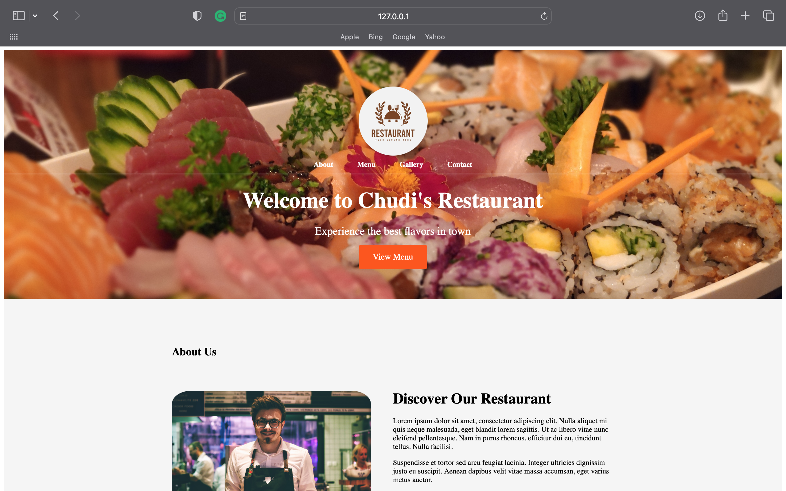

# Restaurant Project

This project is a submission for the Technology Innovation Club hackathon. It is a responsive restaurant landing page built using HTML, CSS, and JavaScript. The landing page features a modern and visually appealing design that showcases the restaurant's ambiance, cuisine, and key features.

## Table of Contents

- [Features](#features)
- [Demo](#demo)
- [Technologies Used](#technologies-used)
- [Getting Started](#getting-started)
- [Contributing](#contributing)
- [License](#license)

## Features

- Responsive layout that adapts to different screen sizes (desktop, tablet, mobile).
- Eye-catching header with the restaurant's logo and a catchy tagline.
- About Us section with a brief description of the restaurant, its history, and mission.
- Menu section to display the restaurant's offerings, including appetizers, main courses, desserts, and beverages.
- Gallery section with a responsive image gallery showcasing high-quality images of the restaurant's interior, dishes, and happy customers.
- Integration with the Unsplash API to fetch random images related to food, dining, and restaurant ambiance.
- Navigation menu for easy exploration of different sections.

## Demo

A live demo of the project can be found [here](https://ochudi-restaurant.netlify.app).

## Technologies Used

- HTML
- CSS
- JavaScript
- Unsplash API

## Getting Started

1. Clone the repository: `git clone https://github.com/ochudi/restaurant_project.git`
2. Open the `index.html` file in your preferred web browser.

## Contributing

Contributions are welcome! If you have any ideas, suggestions, or improvements, please create an issue or submit a pull request.

## License

This project is licensed under the [MIT License](LICENSE).
